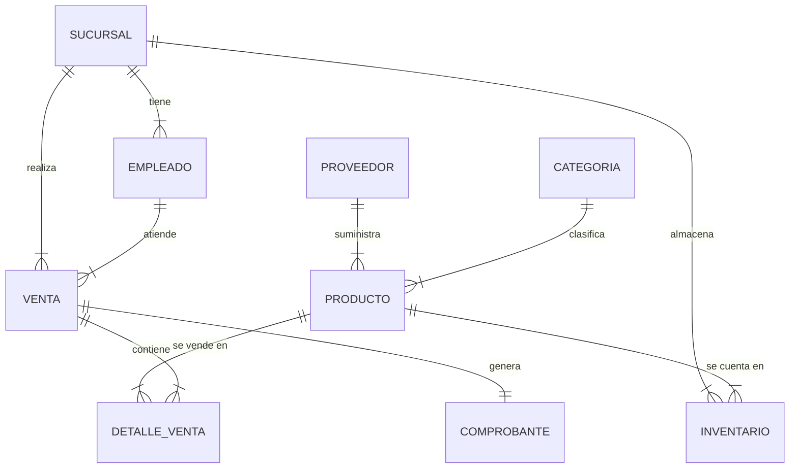

# Sistema de Gestión Comercial - Tienda Mass

Sistema integral de punto de venta (POS) y gestión de inventarios desarrollado para optimizar las operaciones comerciales de Tienda Mass.

## 🚀 Características Principales

### 📦 Gestión de Inventarios
*   **Control multi-sucursal:** Gestión de stock independiente por local.
*   **Ajustes de Stock:** Entradas y salidas manuales (mermas, correcciones).
*   **Kardex:** Historial detallado de movimientos por producto.
*   **Recepción de Mercadería:** Flujo de aprobación y recepción de órdenes de compra.

### 💰 Punto de Venta (POS)
*   **Venta Rápida:** Interfaz optimizada para cajeros.
*   **Validación de Stock:** Bloqueo automático de ventas sin inventario suficiente.
*   **Emisión de Comprobantes:** Generación automática de Boletas/Facturas (Simulado).
*   **Arqueo de Caja:** Control de apertura y cierre de turnos.

### 👥 Administración
*   **Gestión de Usuarios:** Roles diferenciados (Administrador, Cajero, Almacenero).
*   **Reportes:** Dashboard con métricas clave (Ventas del día, Top productos).
*   **Proveedores y Categorías:** Administración de datos maestros.

## 🛠️ Stack Tecnológico

### Backend (API REST)
*   **Lenguaje:** Java 17
*   **Framework:** Spring Boot 3
*   **Base de Datos:** MySQL 8
*   **Seguridad:** Spring Security + JWT
*   **Herramientas:** Maven, Lombok

### Frontend (SPA)
*   **Lenguaje:** JavaScript (ES6+)
*   **Framework:** React 18
*   **Build Tool:** Vite
*   **Estilos:** Tailwind CSS 3
*   **Iconos:** Lucide React
*   **Estado:** Zustand

## 📋 Requisitos Previos

*   Java Development Kit (JDK) 17 o superior.
*   Node.js 18 o superior.
*   MySQL Server 8.0.
*   Maven (opcional, incluido wrapper).

## ⚙️ Instalación y Configuración

### 1. Configuración de Base de Datos
Cree una base de datos vacía en MySQL (o deje que Spring Boot la cree si tiene permisos):
```sql
CREATE DATABASE tiendamass;
```
Configure las credenciales en `backend/src/main/resources/application.properties` si son diferentes a las por defecto (`root`/`200319`).

### 2. Backend (Spring Boot)
```bash
cd backend
# Ejecutar con Maven Wrapper (Windows)
.\mvnw spring-boot:run
# O (Linux/Mac)
./mvnw spring-boot:run
```
El servidor iniciará en `http://localhost:8080`.
*Nota: La primera vez se insertarán datos de prueba automáticamente.*

### 3. Frontend (React)
```bash
cd frontend
# Instalar dependencias
npm install
# Iniciar servidor de desarrollo
npm run dev
```
La aplicación abrirá en `http://localhost:5173`.

## 🔑 Credenciales por Defecto

El sistema inicializa los siguientes usuarios para pruebas:

| Rol | Usuario | Contraseña |
| :--- | :--- | :--- |
| **Administrador** | `admin` | `admin123` |
| **Cajero** | `cajero` | `cajero123` |
| **Almacenero** | `almacen` | `almacen123` |

## 📄 Estructura del Proyecto

*   `/backend`: Código fuente Java/Spring Boot.
    *   `src/main/java`: Controladores, Servicios, Entidades, Repositorios.
*   `/frontend`: Código fuente React.
    *   `src/pages`: Vistas principales (POS, Dashboard, etc).
    *   `src/components`: Componentes reutilizables.
    *   `src/store`: Gestión de estado global (Auth, Notifications).

---
Desarrollado para Tienda Mass - 2025.

## 🏗️ Arquitectura del Sistema

### Diagrama de Entidades (Simplificado)



## 🚀 Guía de Despliegue (Producción)

### Preparar Backend (JAR)
Genera el ejecutable optimizado de Spring Boot:
```bash
cd backend
./mvnw clean package -DskipTests
# El archivo .jar se generará en backend/target/TiendaMas-0.0.1-SNAPSHOT.jar
```
Para ejecutar en producción:
```bash
java -jar target/TiendaMas-0.0.1-SNAPSHOT.jar --spring.profiles.active=prod
```

### Preparar Frontend (Static Build)
Genera los archivos estáticos optimizados para producción:
```bash
cd frontend
npm run build
# Los archivos se generarán en la carpeta frontend/dist
```
Estos archivos deben servirse con un servidor web como Nginx, Apache, o integrarse dentro del directorio `static` de Spring Boot.
